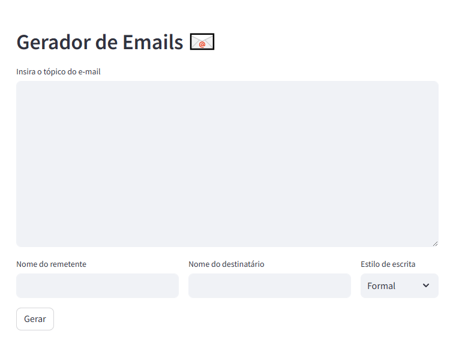

# 📧 Gerador de E-mails com Llama-2

Aplicação em **Streamlit** que gera e-mails automaticamente a partir de um tema, estilo e nomes de remetente/destinatário.  
Usa o modelo local **Llama-2-7B-Chat** via `CTransformers`.

---

## ⚙️ Requisitos

Python 3.10+
streamlit
langchain
langchain-community
ctransformers

Desenvolvido durante o curso: **Learn End to End LLM Generative AI (Gen AI) projects - Langchain - OpenAI, HuggingFace, LLAMA 2 Gemin models Langchain** conduzido por Sharath Raju
